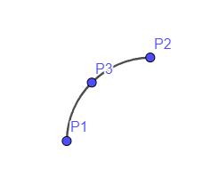

## Topology defining Arcs, Circles, Splines

A feature type using a topology property to reference points defining non-linear curves.

Each geometry type has a specific number of references to "features" defining point geometries.

Where additional properties are required to define the geometry these are included as sub-properties of the topology property.

Additional properties "radius" and "arcLength" are defined for optional use as feature properties.

Note: the geojson: namespace is used for semantic annotations - this may be replaced with a more suitable namespace when a target ontology is available (such as the planned Geosparql version 1.3)

